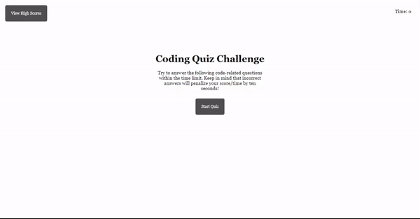

# 04_Code_Quiz_NN
Web APIs: Code Quiz

## The Challenge
At some point in your journey to become a full-stack web developer, you’ll likely be asked to complete a coding assessment—perhaps as part of an interview process. A typical coding assessment includes both multiple-choice questions and interactive coding challenges.
To help familiarize you with these tests and allow you to use the skills covered in this module, our client invites you to build a timed coding quiz with multiple-choice questions. This app will run in the browser and will feature dynamically updated HTML and CSS powered by JavaScript code that you write. It will have a clean, polished, and responsive user interface.




## User Story

```
AS A coding boot camp student
I WANT to take a timed quiz on JavaScript fundamentals that stores high scores
SO THAT I can gauge my progress compared to my peers
```

## Acceptance Criteria

```
GIVEN I am taking a code quiz
WHEN I click the start button
THEN a timer starts and I am presented with a question
WHEN I answer a question
THEN I am presented with another question
WHEN I answer a question incorrectly
THEN time is subtracted from the clock
WHEN all questions are answered or the timer reaches 0
THEN the game is over
WHEN the game is over
THEN I can save my initials and my score
``` 

## The Process
To satisfy our client's needs, we had to:
- Create two HTML files (one to take quiz and one to view scores)
- Add CSS elements to make the quiz's theme purple
- Create two JavaScript files (one containing functions to execute the quiz and one to store previous scores)
- Modify HTML file to dynamically work with JavaScript file

CSS File

```
- Set dark theme for quiz
- Set font for quiz
- Provided interactive CSS for buttons
- Utilized media screen to fit any device's viewport
```
Specific functions in JavaScript file

```
- Variable listing all prompt, options, and answer
- Get elements from DOM (questions, timer, options, submit button, start button, restart button, name and feedback)
- Variable setting quiz's initial state
- Function starting uqiz
- Function looping through array of question and answers and create list with buttons
- Function checking for right answers and deduct time for wrong answer, proceed to next question
- Function ending quiz, stop timer and show final score
- Function ending quiz if timer reaches 0 
- Function saving score in local storage along with users' name
```

Specific functions in Highscore JavaScript file

```
- Get score button element from DOM 
- Rank previous scores in order by retrieving scores from localStorage
- Clear previous scores when users click clear
```
## The Result
After modifying the JavaSript file, we were able to provide a timed coding quiz with a  a clean, polished, and responsive user interface for our client . 

## Submission
This project was uploaded to GitHub at the following repository link:
[https://github.com/nhanng19/timed_quiz](https://github.com/nhanng19/timed_quiz)

Deployed Web Application Link:
[https://nhanng19.github.io/timed_quiz](https://nhanng19.github.io/timed_quiz)
